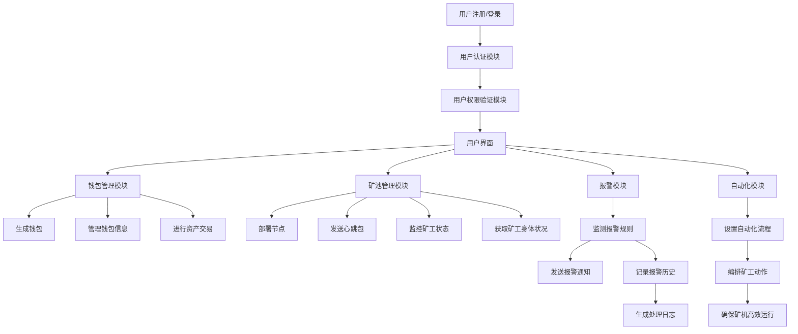
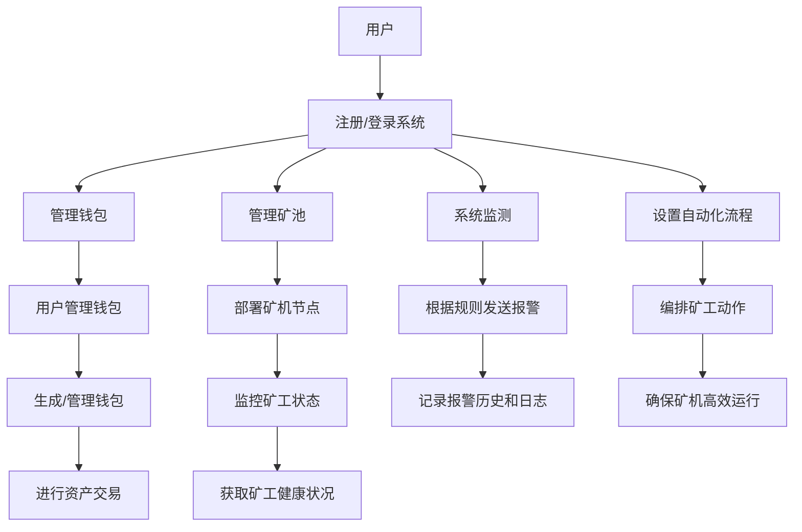
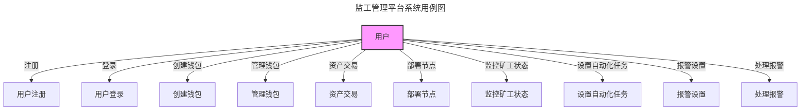
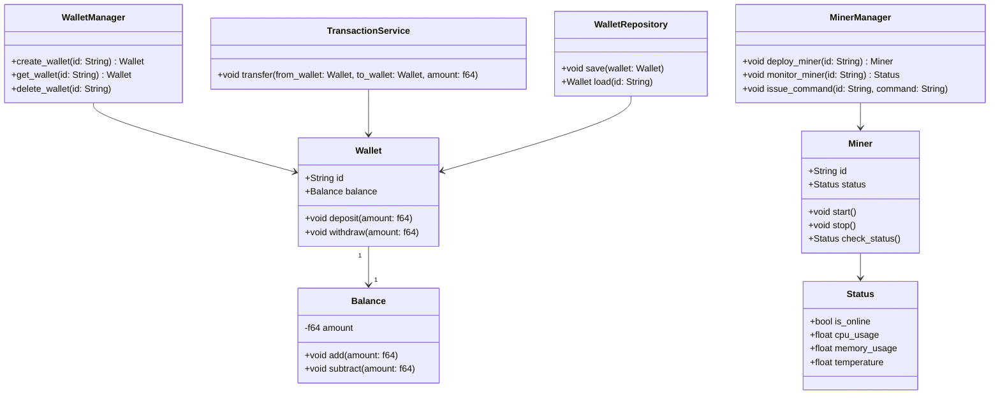

# 监工管理平台系统

## 摘要

本文介绍了一种监工管理平台系统的设计方案，旨在实现接入生产网后高效率的去管理挖矿节点，对矿池进行有效的监控和管理。

该系统的核心业务模块包括钱包管理模块、矿池管理模块和报警模块等核心组件，并提供用户界面使用。只有系统架构设计合理，才能让各模块之间通过定义的接口实现通信和交互，具备良好的扩展性和灵活性，通过该系统能够管理挖矿和撸羊毛。

* 钱包管理模块

  负责对钱包进行管理，可以生成钱包、管理钱包信息以及使用钱包进行交易等。
* 矿池管理模块

  负责下发任务到矿机（矿工）进行管理，包括发送心跳包到矿工进行判活监工、获取矿工的身体状况（CPU、内存占用和温度情况等）和下发命令使矿工执行相关任务等，对矿池进行有效的监控和管理。
* 报警模块

  负责根据预设的报警规则监测监测数据并发送报警通知（例如，矿工宕机）。
* 自动化模块

  负责设置自动化流程。（例如，编排矿工动作）。


## 第1章 绪论

随着 Web 3.0 的快速发展，可以预见到在未来去中心化交易市场是为将是人类交易方式的首选热点，当然这对于我们投机者来说，能否在其中这个浪潮中分到一杯羹是至关重要的。我们要想在其中分到一杯羹的话，对于当下时代背景来说，我们能做的无非有两种方式，一是撸空头薅羊毛获得收益，二是贡献出个人资源进行挖矿获得收益。基于当下时代背景，单打独斗的进行挖矿或者薅羊毛已经不是一种最优的选择了，为了确保我们能够持续稳定地挖矿或针对某种币进行薅羊毛，为提供投机者提供良好赚钱的平台，挖矿管理平台系统应运而生。

挖矿平台系统是一种用于监测矿池情况、矿机性能和钱包变化等情况的工具，它能够及时发现矿工的异常并提供报警通知，以便管理员及时采取措施加以解决。通过本文的研究和实践，我期望设计出一种高效可靠的挖矿平台系统，为科学挖矿提供有效的工具和支持，满足对科学家对与矿池的管理需求。

在本文中，我将首先分析挖矿平台系统的需求和功能，明确系统的目标和作用。然后，我们将介绍系统的设计原则和架构，包括核心组件、数据流动方式以及各模块之间的交互关系。接着，我将详细讨论系统各个模块的设计和实现细节，包括钱包管理模块、矿池管理模块和报警模块等。最后，我将对系统进行测试和评估，验证系统的性能和可靠性。


## 第2章 技术背景

### 2.1 Web 3.0 技术

#### 2.1.1 定义与特征

Web 3.0 是互联网技术发展的第三阶段，它引入了去中心化的理念，旨在通过区块链和分布式账本技术（DLT）来实现数据的自治和去信任化。Web 3.0 的核心特征包括：

* **去中心化**：数据和服务不再依赖于单一的中央服务器，而是分布在多个节点上。
* **用户主权**：用户拥有自己的数据，并且可以完全控制其使用方式。
* **智能合约**：通过区块链技术，智能合约能够自动执行预定义的协议，无需中介机构。
* **互操作性**：不同的区块链和协议可以无缝地进行互操作，促进数据和资产的自由流动。

#### 2.1.2 在监工管理平台中的应用

在监工管理平台中，Web 3.0 技术的应用主要体现在以下几个方面：

* **钱包管理**：利用区块链技术生成和管理钱包，确保钱包的安全性和数据的不可篡改性。
* **矿池管理**：通过智能合约实现矿池的自动化管理，包括任务分配和收益分配等。
* **数据存储**：采用分布式账本技术存储矿工状态和性能数据，确保数据的透明性和可追溯性。
* **报警机制**：通过去中心化的通知系统，及时将报警信息传递给管理员，确保系统的高效运转。

### 2.2 Rust 技术

#### 2.2.1 Rust 简介

Rust 是一种系统编程语言，旨在提供安全性、并发性和高性能。它结合了现代编程语言的功能性和低级语言的性能优势，特别适合用于构建高效可靠的系统。

#### 2.2.2 Rust 的特性

* **内存安全**：Rust 通过所有权系统管理内存，避免了传统编程语言中的空指针和数据竞争问题。
* **高性能**：Rust 的性能接近于 C 和 C++，适用于对性能要求极高的系统编程。
* **并发性**：Rust 提供了线程安全的并发模型，使开发者能够更轻松地编写高效的并发代码。
* **丰富的生态系统**：Rust 拥有丰富的库和工具支持，涵盖了从系统编程到 Web 开发的各个方面。

#### 2.2.3 在监工管理平台中的应用

Rust 在监工管理平台中的应用主要体现在以下几个方面：

* **高效的矿池管理**：Rust 的高性能和并发性使其成为实现矿池管理模块的理想选择，能够高效地处理矿工状态和任务分配等操作。
* **安全的钱包管理**：Rust 的内存安全特性确保了钱包管理模块的安全性，防止了内存泄漏和数据竞争等问题。
* **可靠的报警模块**：Rust 的安全性和稳定性使其非常适合实现高可靠性的报警模块，确保报警信息的及时和准确传递。
* **自动化流程**：利用 Rust 的高性能和并发特性，能够实现复杂的自动化流程编排，提高系统的自动化水平。

### 2.3 其他相关技术

#### 2.3.1 区块链技术

区块链技术是 Web 3.0 的核心支柱之一，它通过分布式账本实现了数据的去中心化和不可篡改性。在监工管理平台中，区块链技术不仅用于钱包管理，还可用于记录矿工的工作状态和性能数据，确保数据的透明和可信。本文将使用 Solana，它是一种区块链技术，旨在实现廉价、可靠和快速的交易。其主要卖点之一是每秒处理大量交易。比其他区块链技术多得多。他们还希望保持较低的交易成本。此外，Solana 支持称为“程序”的智能合约来执行操作，它使用一种称为历史证明的机制来验证区块和交易。

#### 2.3.2 智能合约

智能合约是运行在区块链上的自动化程序，它们能够根据预定义的规则自动执行交易和任务。在监工管理平台中，智能合约可以用于矿池管理、任务分配和收益分配等方面，提高系统的自动化和公平性。

#### 2.3.3 分布式存储

分布式存储技术通过将数据分散存储在多个节点上，提供了高可用性和高可靠性。在监工管理平台中，分布式存储技术可以用于存储矿工的状态和性能数据，确保数据的持久性和可用性。

#### 2.3.4 网络通信

高效可靠的网络通信是监工管理平台的基础，它确保了各模块之间的数据传输和交互。在系统设计中，需要选择合适的网络通信协议和技术，确保系统的高效运行。

### 2.4 本章小结

本章详细介绍了监工管理平台系统所依赖的关键技术，包括 Web 3.0 技术和 Rust 技术。这些技术为系统的设计和实现提供了坚实的基础，使得系统能够高效、安全、可靠地运行。下一章将详细探讨系统的需求分析和功能设计。


## 第3章 系统分析

### 3.1 可行性研究

#### 3.1.1 技术可行性

* **技术选型**：系统采用 Web 3.0 技术和 Rust 语言开发。Web 3.0 提供去中心化的架构，确保系统的安全性和数据的不可篡改性。Rust 语言提供高性能和内存安全，适合处理高并发和高可靠性的任务。
* **系统架构**：设计合理的系统架构，确保各模块之间的接口清晰，数据流动顺畅，具有良好的扩展性和维护性。
* **集成难度**：分析与现有系统和技术的集成难度，评估集成过程中可能遇到的问题和解决方案。

#### 3.1.2 经济可行性

* **成本分析**：评估系统开发、部署和维护的成本，包括硬件、软件和人力资源成本。
* **收益分析**：分析系统上线后可能带来的收益，如提高矿工管理效率、减少停机时间和增加矿池收益等。

#### 3.1.3 操作可行性

* **用户培训**：评估管理员和用户的培训需求，确保他们能够熟练使用系统。
* **操作流程**：分析系统操作流程的复杂性，确保操作简便、易于上手。


### 3.2 需求分析

#### 3.2.1 功能需求

1. **用户管理**

  * 用户注册、登录和认证功能。
  * 用户权限管理，不同用户拥有不同的操作权限。
2. **钱包管理**

  * 生成钱包和管理钱包信息。
  * 使用钱包进行资产交易。
3. **矿池管理**

  * 节点部署和管理。
  * 发送心跳包判活，监控矿工状态。
  * 获取矿工的CPU、内存占用和温度等身体状况。
4. **报警管理**

  * 根据预设的报警规则监测数据并发送报警通知。
  * 提供报警历史记录和处理日志。
5. **自动化管理**

  * 设置自动化流程，编排矿工动作。
  * 自动化任务管理，确保矿机高效运行。

#### 3.2.2 非功能需求

* **性能需求**：系统的响应时间、并发处理能力等。
* **安全需求**：数据保护、访问控制和安全审计等。
* **可靠性需求**：系统的可用性和容错能力等。


### 3.3 系统流程分析

#### 3.3.1 系统流程图（待补充）

* 用户通过注册和登录进入系统。
* 管理员可以通过用户管理模块进行用户权限的分配和管理。
* 管理员通过钱包管理模块生成和管理钱包，并进行资产交易。
* 管理员通过矿池管理模块部署节点，发送心跳包监控矿工状态，获取矿工的身体状况。
* 报警模块根据预设的报警规则监测数据，发送报警通知，记录报警历史和处理日志。
* 自动化模块设置自动化流程，编排矿工动作，确保矿机高效运行。




#### 3.3.2 业务流程图

在业务流程图中，用户首先通过注册和登录进入系统，之后通过不同模块执行各种功能操作。管理员通过用户管理模块分配用户权限，通过钱包管理模块管理钱包和进行资产交易。矿池管理模块用于部署节点、监控矿工状态，并获取矿工的身体状况。报警模块根据设定的规则进行监控和通知，自动化模块则负责编排和执行矿工的自动化任务，确保矿机高效运行。




### 3.4 用例分析

通过用例分析明确系统的具体功能和用户交互，确保系统功能的完整性和用户体验的良好。

#### 3.4.1 用例图（待补充）

用例图描述了系统的主要功能及其与用户的交互关系。具体用例包括用户注册、登录、创建钱包、部署节点、设置自动化任务、报警设置和监控矿工状态等。

#### 3.4.2 用例描述

详细描述每个用例的执行步骤、前置条件和后置条件，确保用例的可执行性和准确性。

| 用例名称       | 描述                                      | 执行步骤                                                | 前置条件   | 后置条件       |
| ---------------- | ------------------------------------------- | --------------------------------------------------------- | ------------ | ---------------- |
| 用户注册       | 用户注册新账户                            | 1. 用户填写注册信息<br />2. 系统验证信息<br />3. 系统创建新用户 | 无         | 用户成功注册   |
| 登录           | 用户登录系统                              | 1. 用户输入账号密码<br />2. 系统验证账号密码                | 用户已注册 | 用户成功登录   |
| 创建钱包       | 生成新的加密货币钱包                      | 1. 用户选择创建钱包<br />2. 系统生成新钱包信息              | 用户已登录 | 新钱包生成     |
| 部署节点       | 部署新的矿工节点                          | 1. 用户选择部署节点<br />2. 系统进行节点配置                | 用户有权限 | 新节点成功部署 |
| 设置自动化任务 | 设置自动化挖矿任务                        | 1. 用户设置任务规则<br />2. 系统保存规则                    | 用户有权限 | 任务规则保存   |
| 报警设置       | 设置矿工异常报警规则                      | 1. 用户设置报警规则<br />2. 系统保存规则                    | 用户有权限 | 报警规则保存   |
| 监控矿工状态   | 实时监控矿工状态，获取CPU、内存等健康信息 | 1. 用户查看矿工状态<br />2. 系统展示矿工状态信息            | 矿工已部署 | 展示矿工状态   |

系统用例图如下所示。




## 第4章 系统设计

### 4.1 系统架构设计

系统架构采用领域驱动设计（DDD）模式进行开发，以确保系统结构的清晰性和可扩展性。

主要分为以下几个层次：

1. **基础设施层（Infrastructure Layer）** ：

  * **仓储（Repositories）** ：负责持久化领域对象，如`WalletRepository`用于存取`Wallet`对象。
  * **第三方集成（Third-party Integrations）** ：与外部系统或服务的交互层，如区块链API的集成。
2. **领域层（Domain Layer）** ：

  * **实体（Entities）** ：代表系统中的核心业务对象，如`Wallet`（钱包）、`Miner`（矿工）等。
  * **值对象（Value Objects）** ：表示没有唯一标识的对象，比如钱包的`Balance`（余额）。
  * **聚合根（Aggregate Roots）** ：控制一组相关对象的生命周期，比如`WalletManager`（钱包管理器）作为`Wallet`的聚合根。
  * **领域服务（Domain Services）** ：包含业务逻辑操作，如`TransactionService`（交易服务）处理跨多个聚合的业务操作。
3. **应用层（Application Layer）** ：

  * **应用服务（Application Services）** ：封装了领域层的业务逻辑并向外部提供接口，如`WalletAppService`负责钱包相关的应用逻辑。
  * **DTO（数据传输对象）** ：用于在不同层之间传递数据。
4. **用户接口层（User Interface Layer）** ：

  * **API接口**：RESTful API或GraphQL接口，提供给前端或第三方系统调用。
  * **用户界面（UI）** ：包括前端界面及其与应用层的交互。

系统目录架构如下：

* **conf**：配置文件目录，包含各种YAML配置文件（如应用配置、JWT配置、日志配置、持久化配置等）。
* **src/core**：核心业务逻辑和领域模型，包括应用层、领域层、基础设施层等。

  * **application**：应用层，包含业务用例（如钱包相关的业务逻辑）。
  * **domain**：领域层，定义了领域实体、值对象、服务等。
  * **infrastructure**：基础设施层，包含与外部系统的集成（如配置、日志、数据库等）。
  * **interfaces**：接口层，包含HTTP请求的处理器、路由定义等。
* **src/bootstrap**：系统启动和初始化相关的代码。
* **src/test**：测试代码。
* **storage/logs**：存放日志文件。


### 4.2 类图

下面是根据系统设计生成的主要类图，采用Rust语言进行实现。





1. **Wallet**: 代表一个钱包对象，具有唯一的`id`和`balance`（余额）。提供了存款和取款操作。
2. **Balance**: 代表钱包的余额，是一个值对象。提供了增加和减少余额的方法。
3. **WalletManager**: 作为`Wallet`的聚合根，管理钱包的创建、获取和删除操作。
4. **TransactionService**: 处理钱包之间的转账操作。
5. **WalletRepository**: 负责钱包对象的持久化操作。
6. **Miner**: 代表一个矿工对象，具有唯一的`id`和`status`（状态）。提供启动、停止和检查状态的方法。
7. **Status**: 代表矿工的状态，包括在线状态、CPU使用率、内存使用率和温度等。
8. **MinerManager**: 作为`Miner`的聚合根，管理矿工的部署、监控和命令下发操作。


### 4.3 数据库设计

#### 4.3.1 **钱包管理表**

表2：`wallets`

* **用途**：存储每个钱包的基本信息。
* **字段**：

  * `id`: VARCHAR(36) (主键，UUID)
  * `balance`: DECIMAL(18, 8) (钱包余额)
  * `created_at`: TIMESTAMP (钱包创建时间)
  * `updated_at`: TIMESTAMP (最后更新的时间)

表2：`transactions`

* **用途**：记录钱包之间的交易信息。
* **字段**：

  * `id`: VARCHAR(36) (主键，UUID)
  * `wallet_id_from`: VARCHAR(36) (外键，来源钱包ID)
  * `wallet_id_to`: VARCHAR(36) (外键，目标钱包ID)
  * `amount`: DECIMAL(18, 8) (交易金额)
  * `transaction_type`: VARCHAR(50) (交易类型，如"deposit", "withdrawal", "transfer")
  * `status`: VARCHAR(50) (交易状态，如"pending", "completed")
  * `created_at`: TIMESTAMP (交易创建时间)
  * `updated_at`: TIMESTAMP (最后更新的时间)

#### 4.3.2 **矿池管理表**

表3：`miners`

* **用途**：存储矿工（矿机）的基本信息。
* **字段**：

  * `id`: VARCHAR(36) (主键，UUID)
  * `status`: VARCHAR(50) (矿工状态，如"online", "offline", "error")
  * `cpu_usage`: FLOAT (CPU使用率)
  * `memory_usage`: FLOAT (内存使用率)
  * `temperature`: FLOAT (矿机温度)
  * `last_heartbeat`: TIMESTAMP (最后一次心跳时间)
  * `created_at`: TIMESTAMP (矿工创建时间)
  * `updated_at`: TIMESTAMP (最后更新的时间)

表4：`miner_commands`

* **用途**：记录下发给矿工的命令信息。
* **字段**：

  * `id`: VARCHAR(36) (主键，UUID)
  * `miner_id`: VARCHAR(36) (外键，矿工ID)
  * `command`: VARCHAR(255) (命令内容)
  * `status`: VARCHAR(50) (命令执行状态，如"pending", "completed", "failed")
  * `created_at`: TIMESTAMP (命令创建时间)
  * `updated_at`: TIMESTAMP (最后更新的时间)

#### 4.3.2 **报警模块表**

表5：`alerts`

* **用途**：存储系统中的报警信息。
* **字段**：

  * `id`: VARCHAR(36) (主键，UUID)
  * `miner_id`: VARCHAR(36) (外键，矿工ID)
  * `alert_type`: VARCHAR(50) (报警类型，如"high_temperature", "offline")
  * `alert_message`: TEXT (报警信息)
  * `status`: VARCHAR(50) (报警状态，如"active", "resolved")
  * `created_at`: TIMESTAMP (报警创建时间)
  * `resolved_at`: TIMESTAMP (报警解决时间，若未解决则为空)

#### 4.3.3 **自动化模块**

表6：`automation_rules`

* **用途**：存储自动化规则的信息。
* **字段**：

  * `id`: VARCHAR(36) (主键，UUID)
  * `name`: VARCHAR(255) (规则名称)
  * `description`: TEXT (规则描述)
  * `trigger_event`: VARCHAR(50) (触发事件，如"heartbeat_missed", "high_temperature")
  * `action`: VARCHAR(255) (执行的动作，如"restart_miner", "send_alert")
  * `status`: VARCHAR(50) (规则状态，如"active", "inactive")
  * `created_at`: TIMESTAMP (规则创建时间)
  * `updated_at`: TIMESTAMP (最后更新的时间)

#### 4.3.4 **用户管理表**

表7：`users`

* **用途**：存储系统用户的信息。
* **字段**：

  * `id`: VARCHAR(36) (主键，UUID)
  * `username`: VARCHAR(255) (用户名)
  * `email`: VARCHAR(255) (用户邮箱)
  * `password_hash`: VARCHAR(255) (密码的哈希值)
  * `role`: VARCHAR(50) (用户角色，如"admin", "user")
  * `created_at`: TIMESTAMP (用户创建时间)
  * `updated_at`: TIMESTAMP (最后更新的时间)

表8：`user_permissions`

* **用途**：存储用户权限信息。
* **字段**：

  * `id`: VARCHAR(36) (主键，UUID)
  * `user_id`: VARCHAR(36) (外键，用户ID)
  * `permission`: VARCHAR(255) (权限名称)
  * `created_at`: TIMESTAMP (权限分配时间)


### 4.4 接口设计

#### 4.4.1 用户管理模块接口

**1. 用户注册**

* **方法**: `POST`
* **URL**: `/api/v1/users/register`
* **请求参数**:

  ```json
  {
  "username": "string",
  "email": "string",
  "password": "string"
  }
  ```
* **响应**:

  ```json
  {
  "id": "string",
  "username": "string",
  "email": "string",
  "created_at": "timestamp"
  }
  ```

**2. 用户登录**

* **方法**: `POST`
* **URL**: `/api/v1/users/login`
* **请求参数**:

  ```json
  {
  "username": "string",
  "password": "string"
  }
  ```
* **响应**:

  ```json
  {
  "token": "string",
  "user": {
  "id": "string",
  "username": "string",
  "email": "string"
  }
  }
  ```

**3. 获取用户详情**

* **方法**: `GET`
* **URL**: `/api/v1/users/{user_id}`
* **请求参数**: 无
* **响应**:

  ```json
  {
  "id": "string",
  "username": "string",
  "email": "string",
  "role": "string",
  "created_at": "timestamp"
  }
  ```

**4. 更新用户权限**

* **方法**: `PUT`
* **URL**: `/api/v1/users/{user_id}/permissions`
* **请求参数**:

  ```json
  {
  "permissions": ["string", "string"]
  }
  ```
* **响应**:

  ```json
  {
  "id": "string",
  "username": "string",
  "permissions": ["string", "string"]
  }
  ```

#### 4.4.2 钱包管理模块接口

**1. 创建钱包**

* **方法**: `POST`
* **URL**: `/api/v1/wallets`
* **请求参数**:

  ```json
  {
  "user_id": "string"
  }
  ```
* **响应**:

  ```json
  {
  "id": "string",
  "balance": 0.0,
  "created_at": "timestamp"
  }
  ```

**2. 获取钱包详情**

* **方法**: `GET`
* **URL**: `/api/v1/wallets/{wallet_id}`
* **请求参数**: 无
* **响应**:

  ```json
  {
  "id": "string",
  "balance": 100.0,
  "created_at": "timestamp"
  }
  ```

**3. 进行资产交易**

* **方法**: `POST`
* **URL**: `/api/v1/wallets/{wallet_id}/transactions`
* **请求参数**:

  ```json
  {
  "wallet_id_to": "string",
  "amount": 50.0,
  "transaction_type": "transfer"
  }
  ```
* **响应**:

  ```json
  {
  "id": "string",
  "wallet_id_from": "string",
  "wallet_id_to": "string",
  "amount": 50.0,
  "transaction_type": "transfer",
  "status": "completed",
  "created_at": "timestamp"
  }
  ```

#### 4.4.3 矿池管理模块接口

**1. 部署矿工节点**

* **方法**: `POST`
* **URL**: `/api/v1/miners`
* **请求参数**:

  ```json
  {
  "miner_id": "string"
  }
  ```
* **响应**:

  ```json
  {
  "id": "string",
  "status": "online",
  "created_at": "timestamp"
  }
  ```

**2. 监控矿工状态**

* **方法**: `GET`
* **URL**: `/api/v1/miners/{miner_id}/status`
* **请求参数**: 无
* **响应**:

  ```json
  {
  "id": "string",
  "cpu_usage": 20.5,
  "memory_usage": 30.2,
  "temperature": 60.0,
  "status": "online",
  "last_heartbeat": "timestamp"
  }
  ```

**3. 发送命令给矿工**

* **方法**: `POST`
* **URL**: `/api/v1/miners/{miner_id}/commands`
* **请求参数**:

  ```json
  {
  "command": "restart"
  }
  ```
* **响应**:

  ```json
  {
  "id": "string",
  "miner_id": "string",
  "command": "restart",
  "status": "pending",
  "created_at": "timestamp"
  }
  ```

#### 4.4.4 报警模块接口

**1. 获取报警列表**

* **方法**: `GET`
* **URL**: `/api/v1/alerts`
* **请求参数**: 无
* **响应**:

  ```json
  [
  {
  "id": "string",
  "miner_id": "string",
  "alert_type": "high_temperature",
  "alert_message": "Temperature exceeded 75°C",
  "status": "active",
  "created_at": "timestamp"
  }
  ]
  ```

**2. 标记报警为已处理**

* **方法**: `PUT`
* **URL**: `/api/v1/alerts/{alert_id}`
* **请求参数**:

  ```json
  {
  "status": "resolved"
  }
  ```
* **响应**:

  ```json
  {
  "id": "string",
  "status": "resolved",
  "resolved_at": "timestamp"
  }
  ```

#### 4.4.5 自动化模块接口

**1. 创建自动化规则**

* **方法**: `POST`
* **URL**: `/api/v1/automation/rules`
* **请求参数**:

  ```json
  {
  "name": "Restart Miner on High Temperature",
  "description": "Automatically restart the miner when temperature exceeds 75°C",
  "trigger_event": "high_temperature",
  "action": "restart_miner"
  }
  ```
* **响应**:

  ```json
  {
  "id": "string",
  "name": "Restart Miner on High Temperature",
  "status": "active",
  "created_at": "timestamp"
  }
  ```

**2. 获取自动化规则列表**

* **方法**: `GET`
* **URL**: `/api/v1/automation/rules`
* **请求参数**: 无
* **响应**:

  ```json
  [
  {
  "id": "string",
  "name": "Restart Miner on High Temperature",
  "status": "active",
  "created_at": "timestamp"
  }
  ]
  ```


### 4.5 UI 设计

#### 4.5.1 UI设计原则

1. **简洁性**：界面设计遵循“少即是多”的原则，只显示用户当前操作所需的信息，减少视觉噪音，提高操作效率。
2. **一致性**：界面的风格、颜色、布局保持一致，确保用户在使用系统的不同部分时，能有统一的视觉和操作体验。
3. **响应式设计**：系统界面支持多设备访问，界面元素会根据不同设备（如PC、平板、手机）的屏幕大小自动调整，确保最佳的用户体验。
4. **易用性**：界面操作简单明了，提供必要的提示和引导，帮助用户轻松完成任务。

#### 4.5.2 主要界面设计

##### 1. **登录/注册界面**

* **功能**：

  * 用户可以通过该界面进行注册或登录操作。
  * 注册页面包含用户名、邮箱和密码输入框，并提供相关的输入验证。
  * 登录页面包含用户名和密码输入框，并支持密码找回功能。
* **界面布局**：

  * 居中布局，简洁的输入框设计，搭配清晰的提示信息。
  * 采用公司Logo或系统名称作为视觉焦点。

##### 2. **仪表盘界面**

* **功能**：

  * 仪表盘为用户提供系统的整体概览，包括钱包余额、矿工状态、报警通知、自动化规则等信息。
  * 通过图表和统计信息，用户可以快速了解当前系统的运行状态。
* **界面布局**：

  * 主要采用卡片式布局，每个模块的信息通过独立的卡片展示，用户可以点击卡片查看详细信息。
  * 支持模块的拖拽和重新排列，用户可以根据需求定制仪表盘布局。
  * 颜色搭配上，采用绿色（表示正常）、黄色（表示警告）和红色（表示异常）来传达不同的状态信息。

##### 3. **钱包管理界面**

* **功能**：

  * 用户可以查看、创建和管理钱包，包括进行资产交易和查看交易历史。
  * 提供直观的余额显示和操作按钮，如“存款”、“取款”、“转账”。
* **界面布局**：

  * 采用左右分栏布局，左侧显示钱包列表，右侧显示选中钱包的详细信息。
  * 交易历史以表格形式展示，支持按时间、金额、类型等条件进行筛选和排序。

##### 4. **矿池管理界面**

* **功能**：

  * 用户可以监控矿工的运行状态、部署新节点、下发命令和查看矿工的资源使用情况。
  * 提供矿工健康状况的图表展示，包括CPU使用率、内存使用率、温度等关键指标。
* **界面布局**：

  * 采用网格布局，显示所有矿工的状态卡片，用户可以点击卡片查看详细信息。
  * 支持矿工状态的实时更新和快速命令下发功能。

##### 5. **报警管理界面**

* **功能**：

  * 用户可以查看系统中的所有报警信息，标记报警为已处理或忽略，查看报警的详细日志。
  * 支持根据报警类型、时间、矿工ID等条件进行筛选和排序。
* **界面布局**：

  * 采用表格布局，列出所有报警信息，表格支持动态加载和分页展示。
  * 每条报警信息都提供详细的日志链接，用户可以点击查看处理历史。

##### 6. **自动化管理界面**

* **功能**：

  * 用户可以创建、编辑和管理自动化规则，查看规则的执行历史和状态。
  * 支持规则的启用、禁用以及条件触发的配置。
* **界面布局**：

  * 采用表单式布局，用户可以通过输入框、下拉菜单和选择框来配置自动化规则。
  * 自动化规则列表以卡片形式展示，支持按状态、名称等条件进行筛选。

##### 7. **用户管理界面**

* **功能**：

  * 管理员可以通过该界面管理用户信息、分配权限、查看用户的操作历史。
  * 支持用户的创建、编辑和删除操作。
* **界面布局**：

  * 左侧为用户列表，右侧为用户详情和权限管理区域。
  * 用户操作历史以时间线形式展示，直观呈现用户的活动记录。

#### 4.5.3 颜色与字体

* **颜色**：

  * 主色调：蓝色 (#1E90FF) - 代表信任和科技感。
  * 辅助色：灰色 (#F0F0F0) - 用于背景和非重点信息。
  * 强调色：绿色 (#32CD32)、红色 (#FF4500) - 分别用于表示正常状态和错误状态。
* **字体**：

  * 主要字体：`Roboto` 或 `Open Sans` - 易读性强，现代感强。
  * 字体大小：14px-18px，用于正文；20px-24px，用于标题和重要信息。

#### 4.5.4 图标与交互设计

* **图标**：

  * 使用简洁、直观的矢量图标，如钱包、矿工、报警等关键功能模块的图标，以增强用户的视觉识别度。
  * 图标风格保持一致，使用统一的图标库如Font Awesome或Material Icons。
* **交互设计**：

  * 强调用户操作的响应性，每次操作后有明显的反馈，如按钮点击后的状态变化、成功/错误提示等。
  * 提供必要的确认对话框，防止用户误操作，特别是在执行删除、转账等关键操作时。

#### 4.5.5 适配与响应式设计

* **多设备适配**：

  * 系统支持PC、平板和手机端的访问，界面元素根据设备屏幕大小自动调整布局。
  * 使用栅格系统实现响应式设计，确保界面在不同设备上的一致性和可用性。
* **无障碍设计**：

  * 界面支持高对比度模式和屏幕阅读器，确保系统对有特殊需求的用户友好。
  * 所有的交互元素（如按钮、链接）都具有明显的可点击性提示。

### 4.6 小结

在本章中，详细描述了监工系统的设计过程，从系统架构到各个模块的类图和接口设计，再到用户界面设计。通过采用领域驱动设计（DDD）模式，我们确保了系统的模块化、可扩展性和可维护性，明确了领域层、应用层、基础设施层和用户接口层的职责分工。

类图展示了系统核心实体及其交互关系，为开发人员提供了清晰的实现思路。接口设计则定义了系统模块之间的通信方式，确保各个模块能够顺畅协作，实现系统的功能需求。用户界面设计注重用户体验，采用简洁、直观的设计原则，确保用户能够轻松上手并高效操作系统。

通过本章的设计，监工系统不仅具有强大的功能性，还具备良好的用户体验。未来，随着业务需求的变化和用户反馈的积累，我们可以在现有设计的基础上进一步优化和扩展系统，确保其在复杂环境下的稳定性和可用性。

本章的内容为后续的系统实现提供了坚实的基础，也为后面在实际开发过程中提供了明确的指导方向。


## 第5章 系统实现


## 第6章 系统测试

### 6.1 系统测试流程

### 6.2 系统测试方法

### 6.3 小结


## 第7章 总结

## 参考


## 附：术语表

### Solana

| 序号 | 英文名                                    | 中文名                 | 简介                                                                                                                                                                                                                                                                                                                            |
| ------ | ------------------------------------------- | ------------------------ | --------------------------------------------------------------------------------------------------------------------------------------------------------------------------------------------------------------------------------------------------------------------------------------------------------------------------------- |
| 1    | account                                   | 账户                   | Solana 分类账中的记录，可以保存数据或作为可执行程序。<br />与传统银行的账户一样，Solana 账户可能持有称为 [lampors](https://solana.com/docs/terminology#lamport)的资金。与 Linux 中的文件一样，它可以由密钥寻址，通常称为[公钥](https://solana.com/docs/terminology#public-key-pubkey)或 pubkey。<br />密钥可能是以下之一：<br />- ed25519 公钥程<br />- 序派生的帐户地址（根据 ed25519 曲线强制得出的 32 字节值）<br />- 包含 32 个字符的字符串的 ed25519 公钥哈希值<br /> |
| 2    | account owner                             | 帐户所有者             | 拥有该帐户的程序的地址。只有拥有该帐户的程序才能够修改该帐户。                                                                                                                                                                                                                                                                  |
| 3    | app                                       | 应用程序               | 与 Solana 集群交互的前端应用程序。                                                                                                                                                                                                                                                                                              |
| 4    | bank state                                | 银行状态               | [在给定的报价高度](https://solana.com/docs/terminology#tick-height)解释账本上所有程序的结果 。它至少包括 持有非零原生代币的所有[账户](https://solana.com/docs/terminology#account)集。                                                                                                                                                                                                                                                                |
| 5    | block                                     | 区块                   | 账本上通过投票涵盖的一组连续的条目。一个领导在每个 slot 最多生成一个区块。                                                                                                                                                                                                                                                      |
| 6    | blockhash                                 | 区块哈希               | 标识记录（块）的唯一值（[哈希](https://solana.com/docs/terminology#hash)）。Solana 根据块的最后一个[条目 ID计算块哈希。](https://solana.com/docs/terminology#entry-id)                                                                                                                                                                                                                                                                             |
| 7    | block height                              | 区块高度               | 当前区块下方的[区块](https://solana.com/docs/terminology#block)数。[创世区块](https://solana.com/docs/terminology#genesis-block)之后的第一个区块高度为 1。                                                                                                                                                                                                                                                                                    |
| 8    | bootstrap validator                       | 引导验证器             | 生成区块链的创世块（第一个块）的[验证者](https://solana.com/docs/terminology#validator)。                                                                                                                                                                                                                                                                                              |
| 9    | BPF loader                                | BPF 加载器             | [拥有并加载BPF](https://solana.com/docs/programs/faq#berkeley-packet-filter-bpf) [链上程序](https://solana.com/docs/terminology#onchain-program)的 Solana 程序 ，允许程序与运行时交互。                                                                                                                                                                                                                                                                                        |
| 10   | client                                    | 客户                   | [访问 Solana 服务器网络集群的](https://solana.com/docs/terminology#cluster)计算机程序。                                                                                                                                                                                                                                                                                                                    |
| 11   | commitment                                | 承诺                   | [对区块的](https://solana.com/docs/terminology#block)网络确认的度量。                                                                                                                                                                                                                                                                                                                |
| 12   | cluster                                   | 簇                     | 维护单个分类账的一组[验证者](https://solana.com/docs/terminology#validator)。                                                                                                                                                                                                                                                                                                          |
| 13   | compute budget                            | 计算预算               | 每笔交易消耗的最大[计算单元](https://solana.com/docs/terminology#compute-units)数。                                                                                                                                                                                                                                                                                                          |
| 14   | compute units                             | 计算单元               | 区块链计算资源消耗的最小计量单位。                                                                                                                                                                                                                                                                                              |
| 15   | confirmation time                         | 确认时间               | [领导者](https://solana.com/docs/terminology#leader)创建 [tick 条目](https://solana.com/docs/terminology#tick)和创建[确认区块](https://solana.com/docs/terminology#confirmed-block)之间的挂钟持续时间。                                                                                                                                                                                                                                                                                                 |
| 16   | confirmed block                           | 已确认区块             | 已获得绝大多数账本投票 [的](https://solana.com/docs/terminology#block)区块。                                                                                                                                                                                                                                                                                                   |
| 17   | control plane                             | 控制平面               | 连接集群所有[节点](https://solana.com/docs/terminology#node)的网络。                                                                                                                                                                                                                                                                                                            |
| 18   | cooldown period                           | 冷却期                 | 委托质押解除后，质押资金会经过一段时间的冷却期，在此期间质押逐渐减少，直到完全解除质押。冷却期结束后，质押者可以提取资金。                                                                                                                                                                                                      |
| 19   | credit                                    | 积分                   | 在Solana中，积分可以是指验证者因正确投票而获得的奖励，通常表现为“投票信用”。这些积分在验证者成功参与共识后累积，并转化为奖励。                                                                                                                                                                                                |
| 20   | cross-program invocation (CPI)            | 跨程序调用             | Solana中的一个程序调用另一个程序的过程。跨程序调用是Solana智能合约之间的交互基础，可以实现复杂的功能和逻辑组合。                                                                                                                                                                                                                |
| 21   | data plane                                | 数据平面               | 在Solana中，数据平面指的是处理实际交易和数据传播的网络层，与控制平面（用于管理和协调）相对。                                                                                                                                                                                                                                    |
| 22   | drone                                     | 空投服务               | 在Solana测试网中，drone 是一个用于向新的账户分发测试代币的服务，帮助开发者在开发和测试期间获取代币。                                                                                                                                                                                                                            |
| 23   | entry                                     | 条目                   | Solana区块链中最小的记录单元，包含交易或空闲信号（tick）。每个条目都是不可变的，代表了链上的某个时刻。                                                                                                                                                                                                                          |
| 24   | entry id                                  | 条目ID                 | 一个唯一的哈希值，用于标识区块链中的每个条目。它是通过对前一个条目的哈希和当前条目的数据进行哈希计算得到的。                                                                                                                                                                                                                    |
| 25   | epoch                                     | 纪元                   | Solana区块链的时间单位，表示为验证者切换领导者的周期。一个epoch由多个slot组成，代表了区块链的一段时间。                                                                                                                                                                                                                         |
| 26   | fee account                               | 手续费账户             | 专门用于存储和支付交易费用的账户。每笔交易都会从手续费账户中扣除一部分费用，支付给验证者。                                                                                                                                                                                                                                      |
| 27   | finality                                  | 最终性                 | 区块链中，某个区块被认为不可逆转且最终确认的状态，意味着所有验证者一致认为该区块及其交易是有效的。                                                                                                                                                                                                                              |
| 28   | fork                                      | 分叉                   | 区块链在某个时间点上分裂为两个或多个不同的链。分叉可能是暂时的，直到网络达成共识，或永久的，导致不同版本的区块链。                                                                                                                                                                                                              |
| 29   | genesis block                             | 创世区块               | 区块链中的第一个区块，通常包含初始化参数和配置，是所有其他区块的基础。                                                                                                                                                                                                                                                          |
| 30   | genesis config                            | 创世配置               | 定义创世区块及其初始状态的配置文件，包括初始代币分配、验证者设置和网络参数。                                                                                                                                                                                                                                                    |
| 31   | hash                                      | 哈希                   | 一个固定长度的字符串，通过对数据进行哈希算法处理得到，用于唯一标识数据块、交易或条目。哈希值在区块链中用于验证数据的完整性。                                                                                                                                                                                                    |
| 32   | inflation                                 | 通胀                   | Solana网络上原生代币SOL的发行机制，随着时间推移，网络通过通胀产生新的SOL代币，通常用于奖励验证者。                                                                                                                                                                                                                              |
| 33   | inner instruction                         | 内部指令               | Solana交易中由程序触发的隐式指令，通常由跨程序调用生成。它们是执行过程中自动生成的，而不是用户直接发起的。                                                                                                                                                                                                                      |
| 34   | instruction                               | 指令                   | Solana交易中执行的一项操作，例如转账、代币铸造或跨程序调用。指令是交易中的基本操作单元。                                                                                                                                                                                                                                        |
| 35   | instruction handler                       | 指令处理器             | 负责在Solana程序中接收并处理指令的函数或逻辑。它们根据指令的内容执行相应的操作。                                                                                                                                                                                                                                                |
| 36   | keypair                                   | 密钥对                 | 包含公钥和私钥的一对密钥。私钥用于签名，公钥用于验证签名和地址生成。在Solana中，密钥对用于账户管理和交易签名。                                                                                                                                                                                                                  |
| 37   | lamport                                   | Lamport                | Solana中最小的代币单位，1 SOL = 10^9 Lamports。命名来源于计算机科学家Leslie Lamport。Solana 区块链上的货币价值通常以 Lamports 表示。这样做可以避免使用浮点数进行计算。                                                                                                                                                          |
| 38   | leader                                    | 领导者                 | 在Solana中，每个slot都有一个指定的验证者作为领导者，负责生成和提交区块。领导者轮换是通过leader schedule（领导者计划）来管理的。                                                                                                                                                                                                 |
| 39   | leader schedule                           | 领导者计划             | 决定每个slot的领导者的计划，确保网络中每个验证者都有机会成为领导者。                                                                                                                                                                                                                                                            |
| 40   | ledger                                    | 分类账                 | 记录所有交易和区块的数据库，包含区块链的完整历史记录。分类账是不可变的，所有参与者都可以查看。                                                                                                                                                                                                                                  |
| 41   | ledger vote                               | 分类账投票             | 验证者对分类账中某个区块的有效性进行投票，以达成共识。                                                                                                                                                                                                                                                                          |
| 42   | light client                              | 轻客户端               | 一个资源较少的客户端，不需要保存完整的区块链数据，只需下载和验证部分数据以确认交易。                                                                                                                                                                                                                                            |
| 43   | loader                                    | 加载器                 | Solana中的加载器程序，负责将BPF程序部署到链上并进行初始化。                                                                                                                                                                                                                                                                     |
| 44   | lockout                                   | 锁定期                 | 验证者在某个区块上投票后，在一定时间内不能撤销或改变该投票的时间段。锁定期越长，验证者的投票越有效。                                                                                                                                                                                                                            |
| 45   | message                                   | 消息                   | Solana交易中包含的一组指令，代表了交易的核心操作内容。                                                                                                                                                                                                                                                                          |
| 46   | Nakamoto coefficient                      | 中本聪系数             | 衡量区块链系统去中心化程度的指标，表示需要联合起来的验证者数量，以控制或破坏网络。系数越高，系统越去中心化。                                                                                                                                                                                                                    |
| 47   | native token                              | 原生代币               | Solana网络中的基础货币单位，即SOL，用于支付交易费用和质押。                                                                                                                                                                                                                                                                     |
| 48   | node                                      | 节点                   | 运行Solana软件的计算机，参与区块链的共识、验证和网络维护。节点可以是验证者节点，也可以是观察节点。                                                                                                                                                                                                                              |
| 49   | node count                                | 节点数                 | Solana网络中活跃参与的节点总数。节点数量通常用来衡量网络的健康状况和去中心化程度。                                                                                                                                                                                                                                              |
| 50   | onchain program                           | 链上程序               | 部署在Solana区块链上的智能合约，能够接受输入并执行预定的逻辑。                                                                                                                                                                                                                                                                  |
| 51   | PoH                                       | 历史证明               | Solana中用于排序和时间记录的算法，通过连续的哈希运算生成一个唯一且可验证的时间戳序列。                                                                                                                                                                                                                                          |
| 52   | point                                     | 点                     | Solana中的投票积分单位，验证者通过参与共识获得点数，用于衡量其对网络的贡献。                                                                                                                                                                                                                                                    |
| 53   | private key                               | 私钥                   | 密钥对中的秘密部分，用于对交易进行签名，持有者必须妥善保管，以防止资金被盗。                                                                                                                                                                                                                                                    |
| 54   | program                                   | 程序                   | 在Solana链上运行的代码模块，通常是智能合约，能够处理交易、调用其他程序并执行逻辑操作。                                                                                                                                                                                                                                          |
| 55   | program derived account (PDA)             | 程序派生账户           | 由Solana程序基于种子值和程序ID生成的账户地址，用于存储和管理与程序相关的数据。                                                                                                                                                                                                                                                  |
| 56   | program id                                | 程序ID                 | 标识Solana链上程序的唯一地址，程序ID是部署时指定的公钥                                                                                                                                                                                                                                                                          |
| 57   | proof of history (PoH)                    | 历史证明               | 一种时间戳记录机制，用于验证事件在Solana区块链上发生的顺序。PoH通过对数据不断进行哈希计算生成一系列唯一的哈希值，形成一个可验证的历史记录。                                                                                                                                                                                     |
| 58   | prioritization fee                        | 优先级费用             | 用户在发送交易时可以支付额外费用以提高交易的优先级，使其更快被验证者处理。                                                                                                                                                                                                                                                      |
| 59   | public key (pubkey)                       | 公钥                   | 一个加密密钥，用于在Solana区块链上唯一标识账户和签名者。公钥与私钥配对，私钥用于签名，公钥用于验证签名。                                                                                                                                                                                                                        |
| 60   | rent                                      | 租金                   | Solana中每个账户需要支付的存储费用，以防止区块链存储资源被滥用。租金是按时间计算的，并且账户中的SOL余额需要足够高才能达到租金豁免状态。                                                                                                                                                                                         |
| 61   | rent exempt                               | 免租金                 | 如果账户中存储的SOL超过了某个门槛值（租金豁免最低余额），该账户将被豁免租金，即不需要继续支付租金，数据将永久保存在链上。                                                                                                                                                                                                       |
| 62   | root                                      | 根                     | Solana区块链中最早的、不可能被回滚的区块。所有验证者都同意该区块及其之前的所有交易是有效的，形成共识。                                                                                                                                                                                                                          |
| 63   | runtime                                   | 运行时                 | Solana的执行环境，负责处理链上程序（智能合约）的执行，管理账户的状态和交易的执行。                                                                                                                                                                                                                                              |
| 64   | Sealevel                                  | Sealevel并行处理器     | Solana的并行智能合约运行时，支持同时执行多个交易，通过使用多线程和处理多个并行指令提高了网络的处理能力。                                                                                                                                                                                                                        |
| 65   | shred                                     | 分片                   | Solana将区块数据分成更小的部分（称为分片）以提高数据传播的效率。每个分片都是区块数据的一部分，通过多个节点传播并最终汇聚成完整的区块。                                                                                                                                                                                          |
| 66   | signature                                 | 签名                   | 由私钥生成的加密证明，表明特定交易或消息的真实性。签名用来验证交易的发送者确实是拥有相应公钥的账户所有者。                                                                                                                                                                                                                      |
| 67   | skip rate                                 | 跳过率                 | Solana中某个领导者在其slot中未能生成区块的比例。较高的跳过率可能表明网络中的性能问题或验证者的配置问题。                                                                                                                                                                                                                        |
| 68   | skipped slot                              | 跳过的slot             | 在Solana网络中，某个领导者未能生成区块的slot，可能是由于网络延迟或其他问题。跳过的slot不会影响后续slot的生成。                                                                                                                                                                                                                  |
| 69   | slot                                      | slot                   | Solana区块链中的时间单位，每个slot都是领导者生成区块的机会窗口。一个slot通常为400ms，一个区块由一个或多个slot组成。                                                                                                                                                                                                             |
| 70   | smart contract                            | 智能合约               | 部署在Solana区块链上的程序，能够自动执行预定义的逻辑。智能合约由用户定义的指令组成，在满足特定条件时自动执行。                                                                                                                                                                                                                  |
| 71   | sol                                       | SOL                    | Solana区块链的原生代币，用于支付交易费用、参与质押和治理。SOL也是网络中衡量价值的基本单位。                                                                                                                                                                                                                                     |
| 72   | Solana Program Library (SPL)              | Solana程序库           | Solana上用于构建和部署通用功能的标准库，包括代币标准（如SPL Token）等。SPL程序库提供了广泛的工具集，用于开发和扩展Solana上的应用程序。                                                                                                                                                                                          |
| 73   | stake                                     | 质押                   | 用户将SOL代币委托给验证者，以支持其参与共识过程。质押者可以从验证者的奖励中获得收益，同时也承担验证者的行为风险。                                                                                                                                                                                                               |
| 74   | stake-weighted quality of service (SWQoS) | 基于质押权重的服务质量 | 在Solana网络中，验证者提供的服务质量与其质押的SOL数量相关联，质押量越高，获得的交易处理机会越多。                                                                                                                                                                                                                               |
| 75   | supermajority                             | 超级多数               | Solana区块链中定义的超过66%的验证者网络权重，用于在网络中达成共识。超级多数需要达成一致意见才能确定区块链的最终状态。                                                                                                                                                                                                           |
| 76   | sysvar                                    | 系统变量               | Solana链上存储的全局变量，提供网络状态的公共信息，如时钟、最近的区块哈希和租金状态等。                                                                                                                                                                                                                                          |
| 77   | thin client                               | 轻客户端               | 不保留完整区块链数据的客户端，仅获取并验证必要的数据来确认交易和账户状态，适用于资源有限的环境。                                                                                                                                                                                                                                |
| 78   | tick                                      | tick                   | Solana中用于记录时间流逝的信号。每个tick表示时间的一个最小单位，多个tick组成一个slot。tick帮助验证者同步网络中的操作。                                                                                                                                                                                                          |
| 79   | tick height                               | tick 高度              | Tick height 是指从Solana区块链的创世块开始所经历的ticks总数。它是时间的一个累积度量，表示从区块链启动以来经过的时间。<br />在每个区块中都有多个tick，每个tick都有一个唯一的高度（tick height），它标志着区块链的时间进度。<br />                                                                                                        |
| 80   | token                                     | 令牌                   | 可进行数字转移的资产。                                                                                                                                                                                                                                                                                                          |
| 81   | Token Extensions Program                  | 代币扩展程序           | [令牌扩展程序](https://spl.solana.com/token-2022)具有程序 ID ，并包含与令牌程序`TokenzQdBNbLqP5VEhdkAS6EPFLC1PHnBqCXEpPxuEb`相同的所有功能，但附带机密传输、自定义传输逻辑、扩展元数据等扩展。                                                                                                                                                                                                                                |
| 82   | Token Program                             | 代币程序               | Token [Program 的](https://spl.solana.com/token)程序ID为 `TokenkegQfeZyiNwAJbNbGKPFXCWuBvf9Ss623VQ5DA`，提供转账、冻结、铸造Token的基本功能。                                                                                                                                                                                                                                                                          |
| 83   | TPS                                       | 每秒交易量             | 每秒[交易次数。](https://solana.com/docs/terminology#transaction)                                                                                                                                                                                                                                                                                                                            |
| 84   | Transaction Processing Unit (TPU)         | 交易处理单元           | [事务处理单元](https://docs.solanalabs.com/validator/tpu)。                                                                                                                                                                                                                                                                                                                              |
| 85   | transaction                               | 交易                   | 客户端使用一个或多个密钥对签名的一条或多[条指令](https://solana.com/docs/terminology#instruction)，以原子方式执行，只有两种可能的结果：成功或失败。                                                                                                                                                                                                                                      |
| 86   | transaction id                            | 交易编号               | 交易中的第一个[签名](https://solana.com/docs/terminology#signature)，可用于在整个分类账中唯一地标识该交易。                                                                                                                                                                                                                                                                          |
| 87   | transaction confirmations                 | 交易确认               | 自交易被接受到账本以来已[确认的区块](https://solana.com/docs/terminology#confirmed-block)数量。当交易的区块成为根时，交易即完成。                                                                                                                                                                                                                                                                |
| 88   | transactions entry                        | 交易条目               | 一组可以并行执行的[事务。](https://solana.com/docs/terminology#transaction)                                                                                                                                                                                                                                                                                                              |
| 89   | Transaction Validation Unit (TVU)         | 交易验证单元           | [交易验证单元](https://docs.solanalabs.com/validator/tvu)。                                                                                                                                                                                                                                                                                                                              |
| 90   | validator                                 | 验证器<br />               | [Solana 网络集群](https://solana.com/docs/terminology#cluster)中生成新 [区块](https://solana.com/docs/terminology#block)的完整参与者。验证者验证添加到账本的交易。<br />                                                                                                                                                                                                                                                                           |
| 91   | verifiable delay function (VDF)           | 可验证延迟函数（VDF）  | 执行该函数需要固定的时间，并生成其运行的证明，然后可以在比生成时间更短的时间内进行验证。                                                                                                                                                                                                                                        |
| 92   | vote                                      | 投票                   | 参见[账簿投票](https://solana.com/docs/terminology#ledger-vote)。                                                                                                                                                                                                                                                                                                                          |
| 93   | vote credit                               | 投票信用               | [验证者](https://solana.com/docs/terminology#validator)的奖励积分。当验证者到达[根节点](https://solana.com/docs/terminology#root)时，其投票账户中会授予验证者投票积分。                                                                                                                                                                                                                                                                  |
| 94   | wallet                                    | 钱包                   | 允许用户管理资金的[密钥](https://solana.com/docs/terminology#keypair)对集合。                                                                                                                                                                                                                                                                                                      |
| 95   | warmup period                             | 预热期                 | [在委托质押](https://solana.com/docs/terminology#stake)后，需要经过一定数量的[周期](https://solana.com/docs/terminology#epoch)，质押才会逐渐生效。在此期间，质押被视为“激活”。有关 [预热和冷却的更多信息](https://docs.solanalabs.com/consensus/stake-delegation-and-rewards#stake-warmup-cooldown-withdrawal)                                                                                                                                                                                                                                                   |


## 目的

```rust
// 池子套利
// 1.有个人有钱，知道sol要涨，买很多sol，池子有很多100个ustc，1000万个sol，数量是对等的。乘积相等，
//     1. 套利：监控买的动作，在别人买之前买，然后卖掉
//     2. 池子有很多个，sol、ustd、ustc、三个池子，交易多个池子获利，一个池子在涨，把另外两个池子的卖了买这个池子的


// https://raydium.io/
// https://www.orca.so/
// https://app.meteora.ag/
// https://jup.ag/
// 自动化交易脚本，usdc 买sol、sol 买 usdt
// 币圈3年一个轮回，每四年减半，减半后半年就到达最高峰。
// 了解交易，现在成熟的已经赚不到了，出来新的可以搞。


// 自动化模块，自动化交易，了解机制，怎么监控别人买（监控链上交易信息，读内存池的数据），怎么
// 买卖币通过第三方网站进行的

```